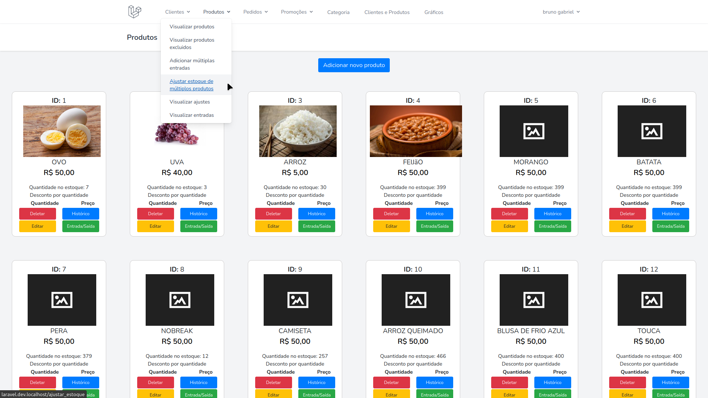

<h1 align="center"> Sistema de Gerenciamento</h1>  

## Table of Contents

- [Introduction](#introduction)
- [Features](#features)
- [Feedback](#feedback)
- [Build Process](#build-process)

## Introduction

...

  

  

  

  

## Features

Funcionabilidade que você consegue fazer com o Sistema de gerenciamento:

* Clientes Cadastrar/Excluir/Atualizar/Listar
* Produtos Cadastrar/Excluir/Atualizar/Listar
* Pedidos  Cadastrar/Excluir/Atualizar/Listar/Filtrar/Tabela de pedidos por clientes
* Criar conta nativo do laravel

## Feedback

Feel free to send us feedback on XXX Feature requests are always welcome.

## Build Process

  

